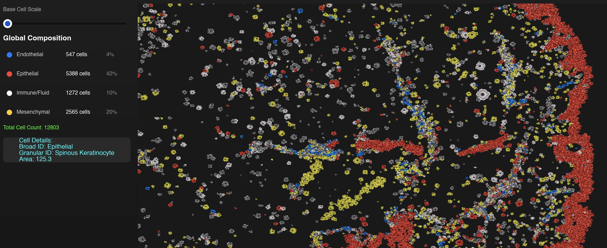

# 🧬 Regenerative SNR Solver
**Measuring Signal-to-Noise Ratio in Non-Neural Networks for Tissue Regeneration**

Traditional Patch-seq allows researchers to simultaneously measure a cell's RNA and its electrical voltage—but it is physically limited to isolated cells (like neurons) and destroys the 3D morphology of solid tissues.

This project bridges the gap between **Bottom-Up Single-Cell Omics** and **Top-Down Morphogenetic Bioelectrics** (the Levin Paradigm). It is a highly parallelized, Rust and WebGPU-accelerated biophysical solver that generates the localized bioelectric field (the Electrome) of non-neural 3D tissues (like skin and gut) directly from spatial transcriptomics data, specifically designed to isolate regenerative bioelectric signals from transcriptomic noise.

## 🚀 The Core Problem & Solution

**The Problem:** In non-neural epithelial tissue, bioelectric communication doesn't occur via rapid action potentials; it occurs via slow voltage gradients across gap junction networks. The biological community struggles to identify which transcriptomic fluctuations are random biological noise and which are instructive regenerative signals. We lack the computational tools to measure the Signal-to-Noise Ratio (SNR) in these dense 3D epithelial syncytiums without destroying the tissue.

**The Solution:** This engine provides a computational replacement for non-neural Patch-seq to map regenerative SNR.
1. We use generative machine learning (`gimVI`) to impute missing bioelectric hardware genes onto 3D morphological scaffolds (Nikon multi-channel scans).
2. We feed that RNA payload into a WebGPU compute pipeline that simultaneously solves 128-gene Stochastic Differential Equations (SDEs) and Goldman-Hodgkin-Katz (GHK) voltage dynamics across 100,000+ cells at 60 frames per second. By explicitly modeling the noise (via Ornstein-Uhlenbeck processes), we can computationally isolate the instructive bioelectric signals driving epithelial regeneration.

## ⏱️ Multi-Scale Temporal Architecture
To accurately simulate biology without collapsing the physics engine, the solver strictly decouples its mathematical operations across three distinct temporal scales:

*   **Fast Scale (Milliseconds/Seconds):** Bioelectric ion diffusion. The highly dynamic voltage ($V_{mem}$) and gap junction ion fluxes are resolved instantly across the spatial topology.
*   **Medium Scale (Hours/Days):** The Gene Regulatory Network (GRN) and univariate gene kinetics. Governs the cell cycle and the stochastic transcriptomic noise generated by the SDEs.
*   **Slow Scale (Years/Decades):** Waddington Optimal Transport (WOT). This drives the macroscopic morphological changes of aging (e.g., matrix fibrosis, sagging) that map directly to the empirical decades of physical decline captured in the 3D Nikon scans.

## ⚙️ Architecture Pipeline

The project is split into two distinct environments: the **Python ML Pre-processor** and the **Rust/WebGPU Physics Engine**.

### 1. Data Harmonization & AI Imputation (Python / `scvi-tools`)
*   **Semantic Classification:** Utilizes `scANVI` with a custom 5-level cascading annotation script to rescue low-confidence cellular identities, bridging raw single-cell reference atlases with spatial matrices.
*   **Hardware Imputation:** Uses `gimVI` to anchor spatial data and impute a 128-gene payload (focusing on bioelectric hardware like *KCNJ2*, *ATP1A1*, *GJA1*).
*   **Waddington Baseline Extraction:** Calculates empirical "Young" vs "Old" transcriptomic vectors to define the WOT (Waddington Optimal Transport) "pull", establishing the baseline trajectories required to differentiate signal from noise.

### 2. The WebGPU Spatial Solver (Rust / WGSL)
Bypassing the memory and thread bottlenecks of Python/CPU biological simulations, the engine executes three primary compute passes per tick, utilizing strict 16-byte aligned memory buffers:

*   **`grn_pass.wgsl`:** Solves the 128-gene SDEs per cell, generating the required stochastic transcriptomic noise. Implements a custom fixed-point integer atomic workaround (`atomicAdd`) to safely compute Eulerian state flux across spatial neighbors.
*   **`physics_pass.wgsl`:** Translates dynamic RNA hardware into physical membrane voltage ($V_{mem}$) using GHK equations and simulates gap junction (`GJA1`) ion transfer to track the regenerative bioelectric signal.
*   **`morpho_pass.wgsl`:** Translates transcriptomic shifts into physical tissue deformation (Newtonian mechanics), correlating high-SNR bioelectric events directly with physical regenerative phenotypes.

## 🗺️ Roadmap & Advanced Features

### Phase 4: Telemetry & Analytics (The Global Laplacian)
Because the `MembraneInterface` (edges) and `CellNode` (vertices) live permanently in GPU buffers, we calculate the Global Laplacian using a single **Parallel Reduction Compute Shader**. This charts the bioelectric syncytium state at 60 FPS without dropping simulation frames, calculating "Senescence" as a mathematical emergent state using three metrics:
1.  **Bioelectric Prepattern:** Measuring spatial variance and clustering of $V_{mem}$ (e.g., identifying depolarization blocks at wound sites vs. healthy resting states).
2.  **Transcriptomic Centroid:** Calculating the latent space distance (Cosine/Euclidean) between the current transcriptomic coordinate of a region and the ground-truth "Young" coordinate.
3.  **Graph Modularity:** Measuring the algebraic connectivity of the CSR topology. Healthy tissue acts as a single conductive network; aged tissue fragments into isolated electrical islands.

### Phase 5: Perturbation & Interaction (Real-Time GUI)
*   **Wound Mechanics (Slicing):** Users can draw a slice in the UI, casting a 3D ray into the Spatial Hash Grid. Intersecting `MembraneInterfaces` instantly have their `connection_strength` set to `0.0`, physically snapping the tissue apart in the physics shader.
*   **Drug Interventions:** Simulating gap-junction blockers requires no looping. A single update to the `PhysicsRulebook` uniform buffer (e.g., changing epithelial `base_conductance` to `0.0`) flatlines the bioelectric flow in the very next frame.

### Phase 6: Validation & Benchmarking
The engine will be benchmarked against standard biological PDE solvers (e.g., BETSE). Because this architecture solves the bioelectric graph locally at the topological edge-level in parallel—bypassing traditional CPU matrix math—we project algorithmic speedups in the magnitudes of 1,000x to 10,000x for equivalent, large-scale cell counts.

## 🛠️ Tech Stack
*   **Engine & Compute:** Rust, WebGPU (wgpu), WGSL
*   **Machine Learning:** PyTorch, scvi-tools (`scVI`, `scANVI`, `gimVI`)
*   **Data Processing:** Scanpy, AnnData, Pandas, NumPy
*   **Domain Focus:** Bioelectric Signal-to-Noise Ratio (SNR), Spatial Transcriptomics, Systems Biology, SDEs
